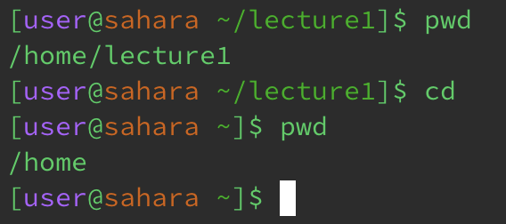
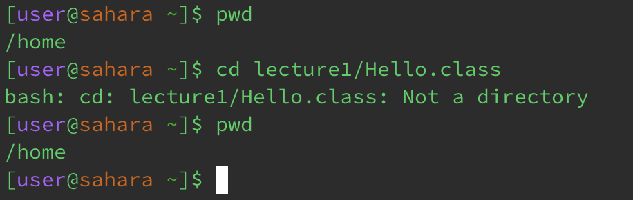
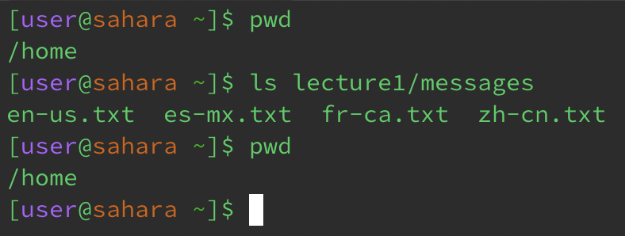
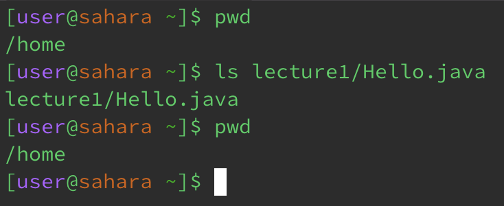
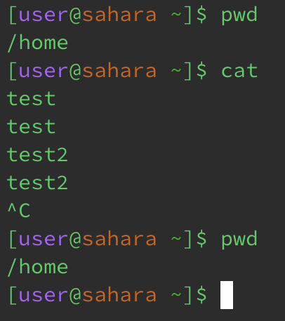

# Lab 1 Report

This lab focuses on the `cd`, `ls` and `cat` terminal commands and how they work with different types of arguments: no arguments, directory path, and file path. The command `pwd` is run before and after each command to show the working directory. 

* `$ cd`
1. `$ cd` (no arguments): _No error_  
The command changes the working directory back to the home directory.
Working directory before command: `/home/lecture1`  
Working directory after command: `/home`  

  

2. `$ cd <path-to-directory>` (a path to a directory as an argument): _No error_  
The command changes the working directory to the directory specified in the path.
Working directory before command: `/home`  
Working directory after command: `/home/lecture1/messages`  

  

3. `$ cd <path-to-file>` (A path to a file as an argument): _Error_  
The command fails to change directories since the specified path points to a file, not a directory.
Working directory before command: `/home`  
Working directory after command: `/home/`  

  

* `$ ls`  
1. `$ ls` (no arguments): The command prints to console the names of the files and folders in the current directory.  

  

2. `$ ls <path-to-directory>` (a path to a directory as an argument): The command prints to console the names of the files and folders in the directory specified in the path.  

  

3. `$ ls <path-to-file>` (a path to a file as an argument): The command prints the filename with the entire specified file path.  

  

* `$ cat`  
1. `$ cat` (no arguments): The console waits for additional input from the user and then proceeds to print whatever you type in until you stop the process with Ctrl+C.  

  

2. `$ cat <path-to-directory>` (a path to a directory as an argument): Error: The command fails to print anything since the specified path points to a directory, not a file.  

  

3. `$ cat <path-to-file>` (a path to a file as an argument): The command prints the contents of the specified file in the filepath.  

  
