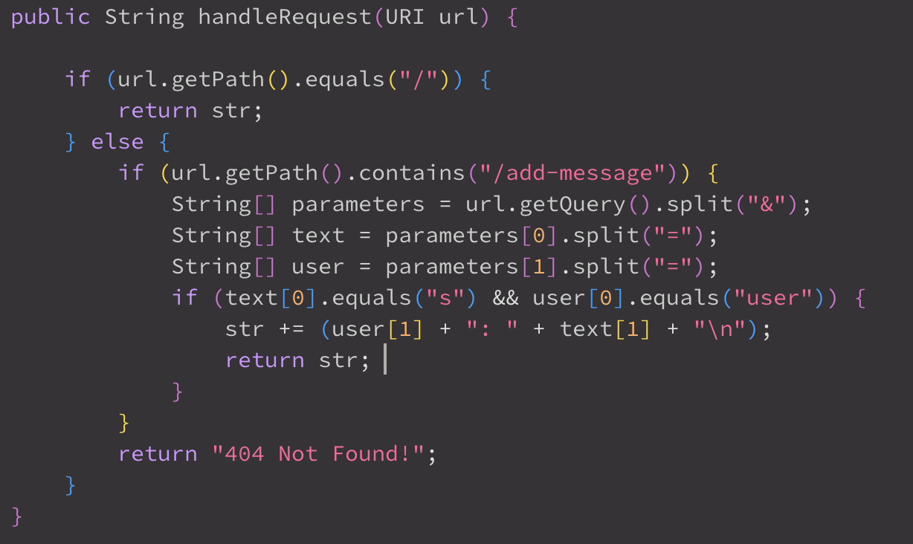
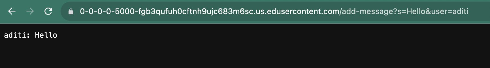
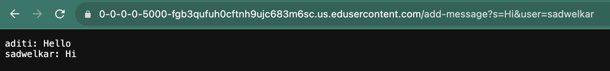
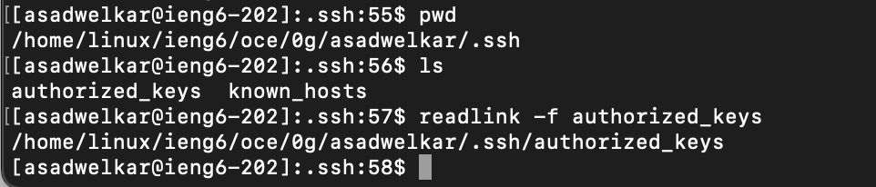
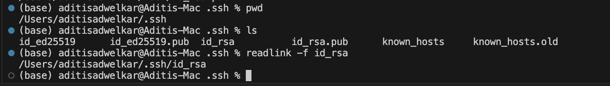
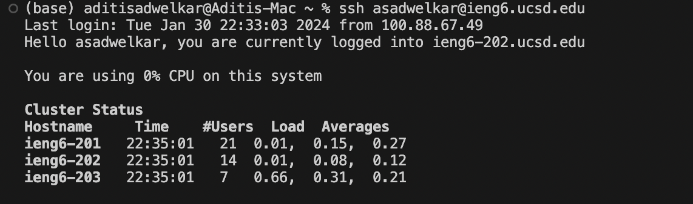

# Lab 2 Report

This lab focuses on creating a server and playing around with url queries. We then shift gears to configuring to the UCSD remote server with a private ssh key.

* Part 1  

Code behind ChatServer:
This is the code within ChatServer, specifically the method that handles incoming url queries.  

 

**First time adding to the chat:**  
The method handleRequest in the Handler class is called once the url qeury has been made. In the method, it goes into the if block that handles the `/add-message` formatted query. The argument relevant for this method is the url, from which the function extracts the query and its parameters. There is only one relevant field in this class, the string `str` that contains the entire chat. When the `/add-message` request is made, the code extracts the user and the text from the query and appends it to the chat. The chat thus contains a record of every user and their corresponding text. In this screenshot, we append the message `Hello` said by the user `aditi`, to the chat, as follows:  
Query: `.../add-message?s=Hi&user=sadwelkar`  

  

**Second time adding to the chat:**  
Again, the method handleRequest in the Handler class is called once the url qeury has been made. It again goes into the if block that handles the `/add-message` formatted query. The argument relevant for this method is the url, from which the function extracts the query and its parameters. There is only one relevant field in this class, the string `str` that contains the entire chat. When the `/add-message` request is made this time, the code extracts the user and the text from the query and appends it to the ongoing chat. In this screenshot, we append the message `Hi` said by the user `sadwelkar`, to the chat, as follows:  
Query: `.../add-message?s=Hi&user=sadwelkar`  

  

* Part 2  

Looking at the ssh key configuration that allows for logging in to the UCSD remote server without a password.

Absolute path to the public key: `/Users/aditisadwelkar/.ssh/id_rsa.pub`  
  
Absolute path to the private key: `/Users/aditisadwelkar/.ssh/id_rsa`  
  
Login without password prompt:  
  

* Part 3

From the labs for week 2 and 3, I've learnt how to run a server and parse url queries through code. I've also learnt about how different computers can essentially interact with each other. through servers. Once you have a server up and running, you can have computers get on the server and manipulate variable through url requests. I can now understand how url requests work in the backend: through if-else clauses that parse paramaters from urls. 
