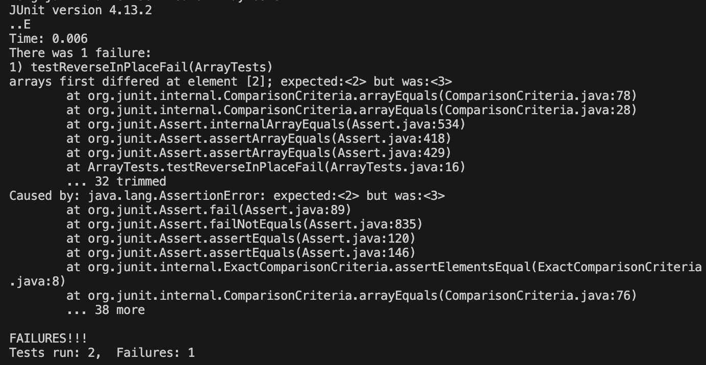

# Lab 3 Report

This lab focuses on identifying bugs in a program through testing and some research on the command `less`. 

* Part 1

Here we look at failure-inducing and non-failure-inducing input for a buggy program. I chose to look at a function that reverses the elements in an array.  
`reverseInPlace()`  

1. Failure-inducing input: A JUnit test that fails when testing `reverseInPlace()`
Using the input array `{ 1,2,3,4 }`, the function will produce `{ 4,3,3,4 }` rather than the correct reversed array `{ 4,3,2,1 }`.

```
public void testReverseInPlaceFail() {  
    int[] input1 = { 1,2,3,4 };  
    ArrayExamples.reverseInPlace(input1);  
    assertArrayEquals(new int[]{ 4,3,2,1 }, input1);  
}
```

2. Non-failure-inducing input: A JUnit test that succeeds when testing `reverseInPlace()`
Using the input array `{ 3 }`, the function will produce `{ 3 }`, which is the correct reversed array.

```
public void testReverseInPlaceSuccess() {  
    int[] input1 = { 3 };  
    ArrayExamples.reverseInPlace(input1);  
    assertArrayEquals(new int[]{ 3 }, input1);  
}
```
3. Symptom of the code: We observe that one of the tests fail (`testReverseInPlaceFail()`) and one of them passes (`testReverseInPlaceSuccess()`).


4. Idenitified bug:  
The function only overwrites the first half of the array. We fix this by overwriting both values at every iteration rather than just one by introducing a `temp` variable. And to avoid overwriting the second half of the array twice, we constrain the range of index values that the `for` loop goes through by changing `i < arr.length` to `i < arr.length/2`.  
  
Code before:  
```
static void reverseInPlace(int[] arr) {
    for(int i = 0; i < arr.length; i += 1) {
        arr[i] = arr[arr.length - i - 1];
    }
}
```
Code after:  
```
static void reverseInPlace(int[] arr) {
    for(int i = 0; i < arr.length/2; i += 1) {
        int temp = arr[i];
        arr[i] = arr[arr.length - i - 1];
        arr[arr.length - i - 1] = temp;
    }
}
```

* Part 2

Here we look at the `less` command and how 4 different options behave on files and directories: `-N`, `+<number>`, `-X`, and `-S`. To show the working of each option, I've used the same 2 text files for my examples to show how the options change the viewing window. 

All these examples have been run from this working directory path:  
```
/Users/aditisadwelkar/documents/academics/school/UCSD winter 2024/cse 15l/docsearch/technical
```

1. Option 1: `-N`  
This option displays the line numbers of the file we're looking at.  
a) Command: `less -N 911report/chapter-1.txt`  
```
      1 
      2         
      3                 
      4 "WE HAVE SOME PLANES"
      5 
      6     Tuesday, September 11, 2001, dawned temperate and nearly cloudless in       6 the eastern United States. Millions of men and women readied themselves fo      6 r work. Some made their way to the Twin Towers, the signature structures o      6 f the World Trade Center complex in New York City. Others went to Arlingto      6 n, Virginia, to the Pentagon. Across the Potomac River, the United States       6 Congress was back in session. At the other end of Pennsylvania Avenue, peo      6 ple began to line up for a White House tour. In Sarasota, Florida, Preside      6 nt George W. Bush went for an early morning run.
      7 
      8     For those heading to an airport, weather conditions could not have bee      8 n better for a safe and pleasant journey. Among the travelers were Mohamed      8  Atta and Abdul Aziz al Omari, who arrived at the airport in Portland, Mai      8 ne.
      9 
:
```
b) Command: `less -N government/Media/5_legal_Groups.txt`  
```
      1 
      2 
      3 
      4 
      5 5 Legal Groups at 1 Locale To Serve the February 3, 2002
      6 Vulnerable
      7 Salt Lake City Tribune
      8 
      9 BY EDWARD MCDONOUGH
     10 Five independent Salt Lake organizations that provide legal
     11 services to the poor, ethnic minorities, seniors and people with
     12 disabilities have joined together to acquire a west-side downtown
     13 building where they will have their offices. The new Community
     14 Legal Center at 205 N. 400 West is a project of "And Justice for
     15 All," which, until this venture, has been a joint fund-raising
     16 campaign by an alliance of the non-profit providers of free legal
     17 services. "And Justice for All," which solicits donations primarily
     18 from Utah lawyers and foundations, was the first joint fund-raising
     19 campaign of legal services agencies in the country, and the
:
```

2. Option 2: `+<number>`  
This option shows the contents fo the file from the specified line number.  
a) Command: `less +8 911report/chapter-1.txt`  

```
    For those heading to an airport, weather conditions could not have been better
 for a safe and pleasant journey. Among the travelers were Mohamed Atta and Abdul Aziz al Omari, who arrived at the airport in Portland, Maine.

INSIDE THE FOUR FLIGHTS

Boarding the Flights

    Boston: American 11 and United 175. Atta and Omari boarded a 6:00 A.M. flight from Portland to Boston's Logan International Airport.

    When he checked in for his flight to Boston, Atta was selected by a computerized prescreening system known as CAPPS (Computer Assisted Passenger Prescreening System), created to identify passengers who should be subject to special security measures. Under security rules in place at the time, the only consequence of Atta's selection by CAPPS was that his checked bags were held off the plane until it was confirmed that he had boarded the aircraft. This did not hinder Atta's plans.

    Atta and Omari arrived in Boston at 6:45. Seven minutes later, Atta apparently
:
```

b) Command: `less +10 government/Media/5_legal_Groups.txt`  

```
Five independent Salt Lake organizations that provide legal
services to the poor, ethnic minorities, seniors and people with
disabilities have joined together to acquire a west-side downtown
building where they will have their offices. The new Community
Legal Center at 205 N. 400 West is a project of "And Justice for
All," which, until this venture, has been a joint fund-raising
campaign by an alliance of the non-profit providers of free legal
services. "And Justice for All," which solicits donations primarily
from Utah lawyers and foundations, was the first joint fund-raising
campaign of legal services agencies in the country, and the
Community Legal Center is the first joint office project of public
service law groups.
The Legal Aid Society of Salt Lake, the Disability Law Center,
the Multi-Cultural Legal Center, the Senior Lawyer Volunteer
Project and Utah Legal Services will share the new facility, and
last Wednesday their board members were given a tour of the
Community Legal Center hosted by staff members of the five
agencies. All of the agencies can share the same reception area and
client waiting room. The building is close in, across the street
:
```

3. Option 3: `-X`  
This options makes sure to not clear the screen when we exit the text file viewer. We can see this in the markdown since the command prompt shows up below.  
a) Command: `less -X 911report/chapter-1.txt`  
```
"WE HAVE SOME PLANES"

    Tuesday, September 11, 2001, dawned temperate and nearly cloudless in the eastern United States. Millions of men and women readied themselves for work. Some made their way to the Twin Towers, the signature structures of the World Trade Center complex in New York City. Others went to Arlington, Virginia, to the Pentagon. Across the Potomac River, the United States Congress was back in session. At the other end of Pennsylvania Avenue, people began to line up for a White House tour. In Sarasota, Florida, President George W. Bush went for an early morning run.

    For those heading to an airport, weather conditions could not have been better for a safe and pleasant journey. Among the travelers were Mohamed Atta and Abdul Aziz al Omari, who arrived at the airport in Portland, Maine.

INSIDE THE FOUR FLIGHTS

Boarding the Flights

(base) aditisadwelkar@Aditis-Mac technical % 
(base) aditisadwelkar@Aditis-Mac technical % 
```
b) Command: `less -X government/Media/5_legal_Groups.txt`  

```
5 Legal Groups at 1 Locale To Serve the February 3, 2002
Vulnerable
Salt Lake City Tribune

BY EDWARD MCDONOUGH
Five independent Salt Lake organizations that provide legal
services to the poor, ethnic minorities, seniors and people with
disabilities have joined together to acquire a west-side downtown
building where they will have their offices. The new Community
Legal Center at 205 N. 400 West is a project of "And Justice for
All," which, until this venture, has been a joint fund-raising
campaign by an alliance of the non-profit providers of free legal
services. "And Justice for All," which solicits donations primarily
from Utah lawyers and foundations, was the first joint fund-raising
campaign of legal services agencies in the country, and the
Community Legal Center is the first joint office project of public
(base) aditisadwelkar@Aditis-Mac technical % 
(base) aditisadwelkar@Aditis-Mac technical % 
```

4. Option 4: `-S`  
The option cuts the lines of the text file that exceed past the viewing screen. We can see the `>` at the end to indicate the line being cut.  
a) Command: `less -S 911report/chapter-1.txt`  
```           
"WE HAVE SOME PLANES"

    Tuesday, September 11, 2001, dawned temperate and nearly cloudless in the eas>

    For those heading to an airport, weather conditions could not have been bette>

INSIDE THE FOUR FLIGHTS

Boarding the Flights

    Boston: American 11 and United 175. Atta and Omari boarded a 6:00 A.M. flight>

    When he checked in for his flight to Boston, Atta was selected by a computeri>

    Atta and Omari arrived in Boston at 6:45. Seven minutes later, Atta apparentl>

    It would be their final conversation.
:
```
b) Command: `less -S government/Media/5_legal_Groups.txt`  

```
5 Legal Groups at 1 Locale To Serve the February 3, 2002
Vulnerable
Salt Lake City Tribune

BY EDWARD MCDONOUGH
Five independent Salt Lake organizations that provide legal
services to the poor, ethnic minorities, seniors and people with
disabilities have joined together to acquire a west-side downtown
building where they will have their offices. The new Community
Legal Center at 205 N. 400 West is a project of "And Justice for
All," which, until this venture, has been a joint fund-raising
campaign by an alliance of the non-profit providers of free legal
services. "And Justice for All," which solicits donations primarily
from Utah lawyers and foundations, was the first joint fund-raising
campaign of legal services agencies in the country, and the
Community Legal Center is the first joint office project of public
:
```


