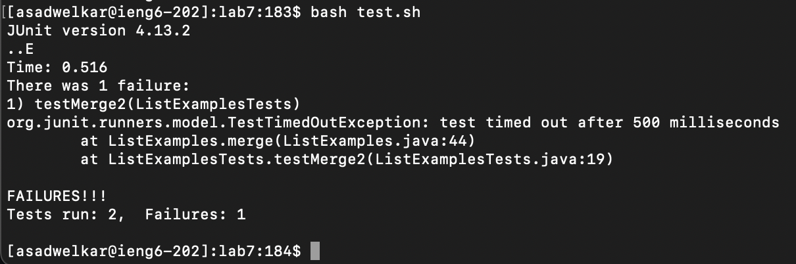
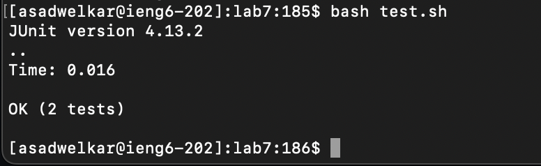

# Lab 4 report

This lab focuses on making changes to files in a github repository and pushing them to remote source control. Using vim, we try to make the process as fast as possible. All of these screenshots have been taken from the terminal, where the series of commands are run.

1. Logging into ieng6 machine: `ssh asadwelkar@ieng6.ucsd.edu <enter>`
Since I have the ssh key setup on my laptop, I can skip logging in with my password.  
  
2. Cloning my fork from my Github account: `git clone git@github.com:ucsd-cse15l-s23/lab7.git <enter>`  
On the ieng6 machine I have a git access token setup so I can clone with `ssh`.
  
3. Running the tests to see they fail: `bash test.sh <enter>`  
The `testMerge2` test fails while the other test passes.  
  
4. Editing the code file: `43 j 11 l x i 2 <esc> : w q <enter>`  
Using the least amount of keystrokes to get to the right line and make the change.  
  
5. Running the tests to see they now succeed: `bash test.sh <enter>`  
  
6. Committing changes to fork, series of cammands: `git add ListExamples.java <enter>`, then `git commit -m "fixed test" <enter>`, then `git push origin main <enter>`  
We stage the `ListExamples.java` file, commit it with the message "fixed test", and then push to origin.  
  
  
