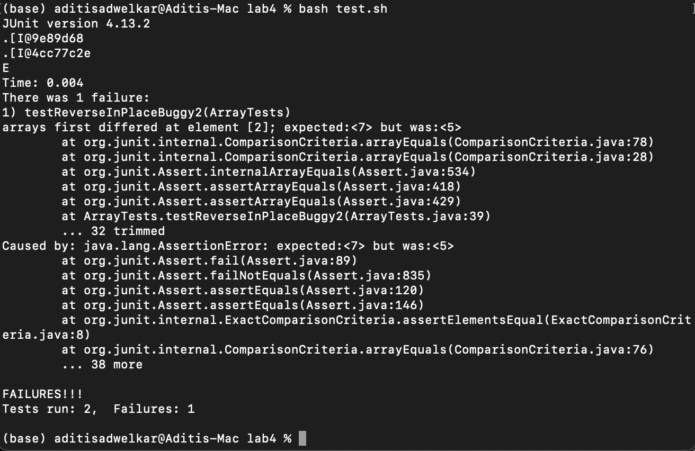

# Lab 5 report

This lab focuses on debugging code starting from the symptom. We create a scenario with buggy code and how a student and TA work together over a discussion thread to firgure out the issue. 

---
## Reverse function only works for some arrays, not others. 
### _Anonymous in lab reports_  
I'm trying to test my reverseInPlace function, but for some reason, only one of my tests successfully run. The error says that there's a "5" found where a "7" is expected but I'm not sure why that would be the case. Any help would be appreciated! I've attached a picture of the test output for reference. I ran this bash script with `bash test.sh`.  
 
