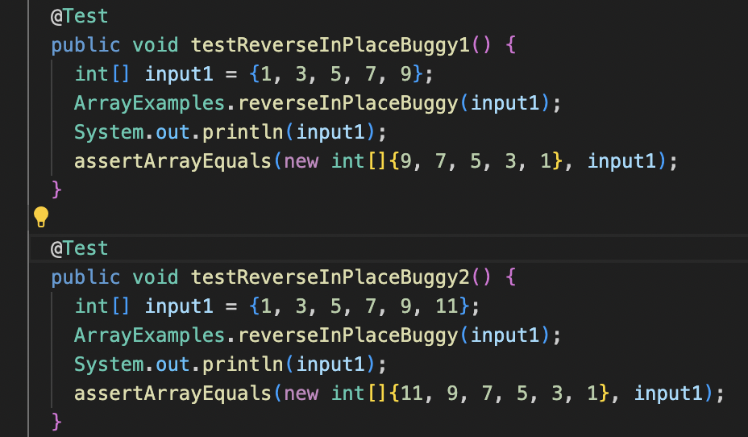
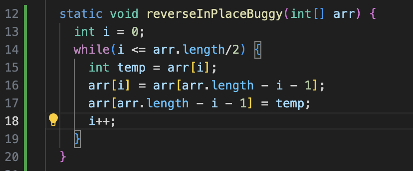
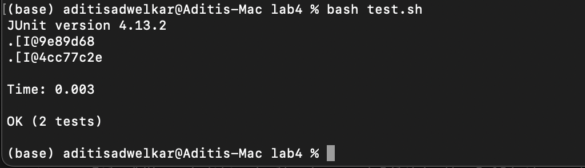

# Lab 5 report

This lab focuses on debugging code starting from the symptom. We create a scenario with buggy code and how a student and TA work together over a discussion thread to figure out the issue. 

* Part 1  
## Reverse function only works for some arrays, not others. 
### _Anonymous in General_   
I'm trying to test my reverseInPlace function, but for some reason, only one of my tests successfully run. The error says that there's a "5" found where a "7" is expected but I'm not sure why that would be the case. Any help would be appreciated! I've attached a picture of the test output for reference. I ran this bash script with `bash test.sh`.  
  

---

### _Teaching Assistant_   
Thanks for reaching out! Let's take a look at some things, can you send over a screenshot of your 2 tests? Which array is correctly reversed and which isn't? Let's take a look at your file structure as well. 

---

### _Anonymous_  
Sounds good, I've attached a picture of the 2 tests and I've included the file structure in markdown.  
  
```
- lab4
  - lib/
    - hamcrest-core-1.3.jar
    - junit-4.13.2.jar
  - ArrayExamples.java
  - FileExample.java	
  - ArrayTest.java
  - LinkedListExample.java	
  - ArrayTests.java
  - ListExamples.java
  - test.sh
```

---

### _Teaching Assistant_   
OK, looks like the file structure shouldn't be posing the issue. Since your second test fails, I'm guessing your method implementation has issues with even length arrays. Can you include a picture of your function? Try printing out the array after it is reversed to see what it looks like. Or use jdb to see what is in the array after reversing, go through these commands:  
```
$ javac *.java 
$ jdb ArrayTests
```
Then in the jdb command prompt:  
```
> stop at ArrayTests: <line number after reversing>  
> run
> print input1
```  

---

### _Anonymous_   
Thanks! I see the issue now, input1 was printed to be this: `{11, 9, 5, 7, 3, 1}` which is strange since I expected this: `{11, 9, 7, 5, 3, 1}`. Here is a screenshot of the code:  
  

---

### _Teaching Assistant_   
Ah, I see the issue! You're moving an extra index and swapping the middle elements in your array twice. And you only see the issue with even length arrays since the element is swapped with itself in odd length arrays. Try changing the condition in your while loop to this so that you avoid making the last unnecessary swap: `i < arr.length/2`  

---

### _Anonymous_   
This worked! Thanks for your help, both tests pass now!    
  
